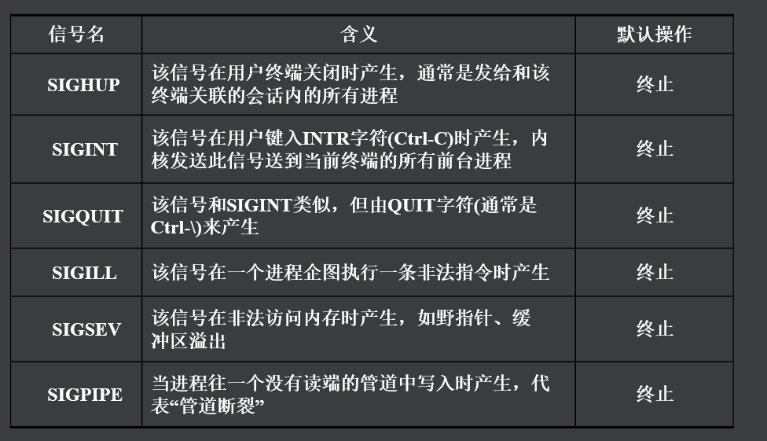
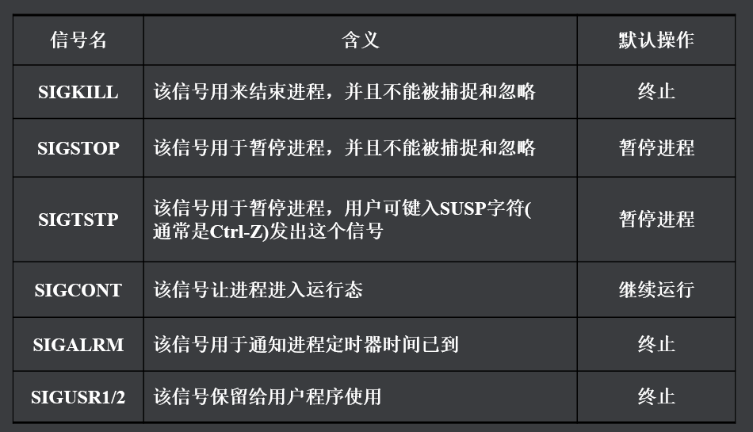

## 进程间通信方式(7种)(**重要**)

> 1. 传统进程间通信
> 	1. 无名管道
> 	2. 有名管道
> 	3. 信号
> 2. systemV (IPC)进程间通信
> 	1. 消息队列
> 	2. 共享内存
> 	3. 信号灯集
> 3. BSD设计的套接字通信
> 	1. 借助网络实现本地进程间通信


### 1. 无名管道(亲缘关系进程)

> 无名管道通信原理：如果A和B进程想要通过无名管道通信，那就必须在内核空间创建一个无名管道（64K），A和B进程必须是亲缘关系的进程，A进程向管道的一端写数据，B进程可以从管道的另外一端读数据。在A进程和B进程进行数据传输的时候是不允许使用lseek函数的。无名管道是半双工的通信方式。如果A进程一直向管道中写数据写满64K的时候A进程阻塞，直到B进程读一部分数据之后A才能继续写。如果B进程在读数据的时候，无名管道是空的，B进程阻塞。
>
> 单工	半双工	全双工

```c
// 1.创建无名管道
int pipe(int pipefd[2]);
功能：创建无名管道
参数：
    @pipefd[2]:管道两端的文件描述符
    	pipefd[1]:写端
    	pipefd[0]:读端
返回值：成功返回0，失败返回-1置位错误码
```

> 无名管道读写特点：
> **读端存在（不读），写管道**：写端有多少数据就写多少数据，直到写满为止（64K），写阻塞
> **写端存在（不写），读管道：**管道中有多少数据读多少数据，没数据读的时候读端阻塞
> **读端不存在，写管道**：进程收到管道破裂的信号（SIGPIPE）,杀死进程。
> **写端不存在，读管道**：管道中有多少数据读多少数据，没数据读的时候读端立即返回

### 2. 有名管道(任意进程)

> 有名管道可以实现任意进程间的通信，有名管道的大小也是64K，有名管道也是不支持lseek,有名管道也是半双工的通信方式。有名管道创建之后会在**用户空间产生一个管道文件**，这个管道文件是在**内存**上存储的。如果A和B两个进程想要通过有名管道通信，就打开管道文件，向管道中写向管道中读就可。

```c
int mkfifo(const char *pathname, mode_t mode);
功能：创建一个有名管道
参数：
    @pathname:管道文件的路径及名字
    @mode:管道文件的权限
         (mode & ~umask)
返回值:成功返回0，失败返回-1置位错误码
```

> 有名管道读写特点：
> **读端存在（不读），写管道**：写端有多少数据就写多少数据，直到写满为止（64K），写阻塞
> **写端存在（不写），读管道：**管道中有多少数据读多少数据，没数据读的时候读端阻塞
>
> **读端不存在，写管道**：
>
> ​	读端没有打开，写端在open的位置阻塞
>
> ​	读端先打开后关闭，写管道进程收到管道破裂的信号（SIGPIPE）,杀死进程。
>
> **写端不存在，读管道**：
>
> ​	写端没有打开，读端在open的位置阻塞
>
> ​	写端先打开后管道，读端管道中有多少数据读多少数据，没数据读的时候读端立即返回

### 3. 信号

> 一个进程在执行的时候用户可以通过kill命令或者操作系统给当前的进程发送信号
> 进程对当前的信号的响应方式：**默认，忽略，捕捉**

#### 常用信号量




> SIGCHLD:当子进程退出的时候，父进程会收到这个信号
>
> 注：在所有的信号中，只有SIGKILL/SIGSTOP两个信号不能被捕捉，不能被忽略，只能执行默认的动作。

```c
// 进程对信号处理方式指定的函数
typedef void (*sighandler_t)(int);
sighandler_t signal(int signum, sighandler_t handler);
功能：在进程中，给信号指定处理方式
参数：
    @signum:信号号
    @handler:函数指针变量
        SIG_IGN ：忽略
        SIG_DFL ：默认
        signal_handle：捕捉
            
        void signal_handle(int signo)
        {
            //信号处理函数
        }
返回值：成功返回函数指针，失败返回SIG_ERR,置位错误码
```

```c
// 发信号相关函数

int raise(int sig);
功能：给自己发信号
参数：
    @sig:信号号
返回值：成功返回0，失败返回非0
        
int kill(pid_t pid, int sig);
功能：给指定pid的进程发送信号
参数：
    @pid:进程号
       pid > 0 :给pid号的进程发信号
       pid = 0 :给同组的进程发送信号
       pid = -1:给所有有权限的进程发送信号
       pid <-1:首先会对pid取绝对值，给和这个绝对值相同的组的进程发送信号
    @信号号
返回值：成功返回0，失败返回-1置位错误码

unsigned int alarm(unsigned int seconds);
功能：当seconds倒计时为0的时候发送SIGALRM信号
参数：
    @seconds:秒钟数，如果填写为0，取消挂起的信号
返回值：如果alarm是第一次调用，返回0.
        如果alarm不是第一次调用，返回上一次调用的剩余秒钟数
        alarm(5);  //返回值是0
        sleep(2);  //延时2s
        alarm(5);  //返回值是3
```

### 4. 消息队列(根据类型读取信息)

~~~shell
# 查看IPC进程间通信的命令
ipcs
ipcs -q/-m/-s
# 删除IPC进程间通信的命令
ipcrm -q/-m/-s msqid/shmid/semid
~~~

```c
// IPC进程间通信键值获取
key_t ftok(const char *pathname, int proj_id);
功能：获取键值
参数：
        @pathname:文件的路径及名字
        @proj_id:整数值，只有低8bit有效(随意写)
返回值：成功返回键值，失败返回-1置位错误码
```

> 如果想要使用消息队列实现进程间通信，就必须在内核空间创建出来消息队列，消息队列默认大小是16384（16K）,当创建好消息队列之后A进程可以向消息队列中发消息，消息的格式是类型+正文。当消息队列满的时候A进程如果还想往消息队列中发消息A进程休眠。B进程可以通过消息的类型从消息队列中取消息，取出的消息从队列中移除。如果B进程想要获取的消息类型在队列中不存在B进程休眠等。

```c
int msgget(key_t key, int msgflg);
功能：创建消息队列
参数：
    @key：键值
        key:通过ftok获取
        IPC_PRIVATE：只能用于亲缘间进程的通信
    @msgflag：消息队列的标志位
        IPC_CREAT|0666  或   IPC_CREAT|IPC_EXCL|0666
返回值：成功返回消息队列号，失败返回-1置位错误码

int msgsnd(int msqid, const void *msgp, size_t msgsz, int msgflg);
功能：向消息队列中发消息
参数：
    @msqid:消息队列号
    @msgp:消息的首地址
          struct msgbuf {
               long mtype;     //消息的类型，必须大于0
               char mtext[255];  //消息的正文
           };
	@msgsz:消息正文的大小
	@msgflg:消息的标志
        0：阻塞发送
        IPC_NOWAIT：非阻塞发送
返回值：成功返回0，失败返回-1置位错误码

ssize_t msgrcv(int msqid, void *msgp, size_t msgsz, long msgtyp,int msgflg);
功能：从消息队列获取消息
参数：
    @msqid：消息队列号
    @msgp：消息的首地址
    @msgsz：消息正文的大小
    @msgtyp：消息的类型
        	如果=0，接收消息队列中的第一个消息
        	如果>0 ,接收msgtyp指定的消息类型
        	如果<0，那么将读取队列中第一个最小类型小于或等于msgtyp绝对值的消息。
            2-3-100-500-30-2000
                -100===>100
            2-3-100-30
    @msgflg：消息的标志
        0：阻塞接收
        IPC_NOWAIT：非阻塞接收
返回值：失败返回-1置位错误码。成功返回接收接收的字节的个数

int msgctl(int msqid, int cmd, struct msqid_ds *buf);
功能：消息队列的控制
参数：
    @msqid：消息队列号
    @cmd：命令码
        IPC_STAT：获取消息队列的属性
         IPC_SET：设置消息队列的属性
        IPC_RMID:立即删除消息队列，唤醒所有等待的读取器和写入
            器进程(返回一个错误并将errno设置为EIDRM)。调用进程
            必须具有适当的特权，或者它的有效用户ID必须是消息队
            列的创建者或所有者的ID。在这种情况下，msgctl()的/*第
            三个参数将被忽略*/。
    @buf：msqid_ds消息队列属性结构体
返回值：成功返回0，失败返回-1，置位错误码

eg:
	msgctl(msqid,IPC_RMID,NULL);
```

### 5. 共享内存(效率最高)

> 共享内存是所有进程间通信方式中效率最高的一个，因为当创建共享内存之后，需要通信的A和B进程可以直接操作这块物理内存空间 ，省去了向内核拷贝数据的过程。共享内存的大小是4K的整数倍。

~~~c
int shmget(key_t key, size_t size, int shmflg);
功能：创建共享内存
参数：
    @key:键值
        key:通过ftok获取
        IPC_PRIVATE：只能用于亲缘间进程的通信
    @size:共享内存的大小 4k整数倍
    @msgflag:共享的标志位
        IPC_CREAT|0666  或   IPC_CREAT|IPC_EXCL|0666
返回值：成功返回共享内存编号，失败返回-1置位错误码

void *shmat(int shmid, const void *shmaddr, int shmflg);
功能：映射共享内存到当前的进程空间
参数：
    @shmid:共享内存的编号
    @shmaddr:NULL，让系统自动分配
    @shmflg:共享内存的操作方式
         0：读写
         SHM_RDONLY：只读
返回值：成功返回共享内存的首地址，失败返回（void *）-1,并置位错误码

int shmdt(const void *shmaddr);
功能：取消地址映射
参数：
    @shmaddr:指向共享内存的指针
返回值：成功返回0，失败返回-1置位错误码

int shmctl(int shmid, int cmd, struct shmid_ds *buf);
功能：共享内存控制的函数
参数：
    @shmid:共享内存的编号
    @cmd:操作的命令码
         IPC_STAT ：获取
         IPC_SET：设置
         IPC_RMID：删除共享内存
        	标记要销毁的段。实际上，只有在最后一个进程将其分离之后
        	(也就是说，关联结构shmid_ds的shm_nattch成员为零时)，
        	段才会被销毁。调用者必须是段的所有者或创建者，或具有特权。buf参数被忽略。
	@buf:共享内存属性结构体指针
返回值:成功返回0，失败返回-1置位错误码
~~~

### 6. 信号灯集(信号量)

> 信号灯集：是实现进程同步的机制，在一个信号灯集中可以有很多个信号灯。在信号灯集内信号灯相互独立，每个灯的值的改变不会影响其他的信号灯，信号灯的值一般设置为二值量（1或者0，1代表有资源，0代表没有资源）。

```c
int semget(key_t key, int nsems, int semflg);
功能：创建一个信号灯集
参数：
    @key:键值
         IPC_PRIVATE 
         key
    @nsems:信号灯集合中信号灯的个数
    @semflag:创建的标志位
        IPC_CREAT|0666  或  IPC_CREAT|IPC_EXCL|0666
返回值：成功返回semid,失败返回-1置位错误码
        
        
int semctl(int semid, int semnum, int cmd, ...);
功能：信号灯集的控制函数
参数：
    @semid信号灯集的ID
    @senum:信号灯的编号
    @cmd:命令码
        SETVAL：设置信号灯的值 --->第四个参数val选项
        GETVAL：获取信号灯的值 --->不需要第四个参数
		IPC_STAT：获取信号灯集的属性--->第四个参数buf选项
        IPC_SET ：设置信号灯集的属性--->第四个参数buf选项
		IPC_RMID:第二参数被忽略，第4个参数不用填写
    @...:
	 union semun {
               int  val;    /* Value for SETVAL */
               struct semid_ds *buf;    /* Buffer for IPC_STAT, IPC_SET */
           };
返回值：失败返回-1置位错误码
    	成功：
    		GETVAL:成功返回信号灯的值，其余的命令码成功返回0

int semop(int semid, struct sembuf *sops, size_t nsops);
功能：信号灯集中信号灯的操作函数
参数：
    @semid:信号灯集的编号
    @sops:操作方式
        struct sembuf{
           unsigned short sem_num;  //信号灯的编号
           short          sem_op;   //操作方式（PV）
            						-1:P操作，申请资源
                                     1:V操作，释放资源
           short          sem_flg;  //操作的标志位
            						0：阻塞
                                    IPC_NOWAIT：非阻塞方式操作
        }
     @nsops:本次操作信号灯的个数
返回值：成功返回0，失败返回-1置位错误码
```

### 7. 套接字通信