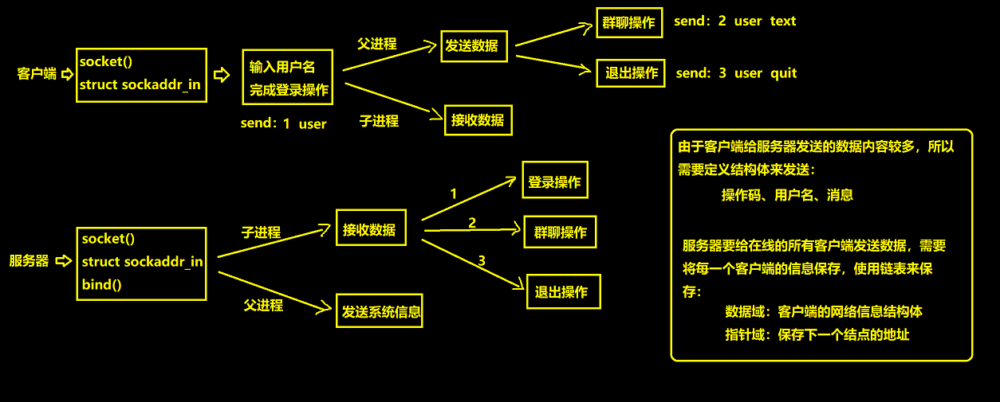

# 手记

## 静态库

```gcc -c ./src/linklist.c  -o linkkist.o -I ./inc/
gcc -c ./src/linklist.c  -o linkkist.o -I ./inc/
ar -cr liblinklist.a linkkist.o
gcc ./src/main.c -L ./lib/ -llinklist -I inc/ -o ./bin/a.out
```

## 动态库

```gcc -fPIC -shared ./src/linklist.c -o ./lib/liblinklist.so -I ./inc/
gcc -fPIC -shared ./src/linklist.c -o ./lib/liblinklist.so -I ./inc/
gcc ./src/main.c -L ./lib/ -llinklist -I ./inc/ -o ./bin/a.out
sudo vi /etc/ld.so.conf.d/libc.conf
sudo ldconfig
```

task_struct
ps -el(查看优先级) -ef(查看父子关系)
ps -ajx | grep a.out
top htop pidof,
PPID PID PGID SID

普通进程静态优先级 100\~120\~139
实时进程：数值越大优先级越高
普通进程：数值越小优先级越高
fork() 2^n^
man **2 系统调用 3 库函数**
getpid() getppid() `
exit(status)库函数刷新缓存区 \_exit(status)系统调用不刷新缓存区
wait(wstaus)

### 重定向

```c
//umask(0);
dup2(fd,0)=close(0)+dup(0);
```

### 多线程使用

```c
//线程代码块
void* thread(void* arg){
    printf("thread is runing\n");
    while(1);
}

int main(){
    pthread_t tid;
    if(pthread_create(&tid,NULL,thread,NULL));
     PRINT_ERR("pthread_create error");
    printf("pthread is runing\n");
     while(1);
    return 0;
}
//gcc xxx.c -lpthread
```

### 线程互斥

```c
//1.定义互斥锁(全局变量，否则线程无法访问)
pthread_mutex_t mutex;
//2.初始化互斥锁
pthread_mutex_init(&mutex,NULL);
//3.销毁互斥锁
pthread_mutex_destroy(&mutex);
```

### 线程同步(顺序)

#### 无名信号量

```c
//PV操作，申请释放资源
//1.定义无名信号量
sem_t sem1,sem2;
//2.初始化无名信号量
sem_init(&sem1,0,1);
sem_init(&sem2,0,0);
//3.销毁无名信号量
sem_destroy(&sem1);
sem_destroy(&sem2);
```

#### 条件变量

cond

#### 管道

写阻塞即休眠

**重点:**

---

vscode gbd 需要 windows 安装编译器

#### 进程间通信 **重点**

传统通信方式：无名管道，有名管道
IPC 方式：消息队列，共享内存，信号灯集
**共享内存效率最高**，省去了向内核搬运数据的过程，直接访问物理内存。(4k 的整数倍)

查看 IPC 进程间通信的命令 ipcs -q/m/s
删除命令 ipcrm -q/m/s msqid/shmid/semid
**消息队列，共享内存，信号灯集**

---

protocol 协议
ARPAnet 阿帕网 **NCP 不能纠错不兼容**

TCP/IP:tcp 纠错，ip 兼容不同互联网
协议：发送解析的规则
网络体系结构：ISO 提出 OSI 体系结构和**TCP/IP 协议族体系结构**
七层：物理层，数据链路，网络(路由)，传输，|会话，表示，应用

 （物数网传会表应）

四层:

 链路层：负责不同物理网络的链接(以太网)(**Ethernet**)ARP 地址解析协议，RARP 逆向地址解析

 网络层：负责数据的传输，路径及地址选择(IP)(**Internet**)
​ IP 网际互联协议,ICMP(ping)互联网控制信息,IGMP(组播)互联网组管理

 传输层：确定数据传输及进行纠错(端口号)(**Transmission**)
​ TCP 传输控制协议,UDP 用户数据报
​ 有链接可靠(重传)效率低，反之

 应用层：服务及应用程序通过该层利用网络(组装数据加密)
​ HTTP(S)超文本传输协议,FTP 文件传输,TFTP 简单文件传输,SMTP 简单邮件传输

1.组装数据 FTP 2.封装 TCP 头 3.封装 IP 头 4.封装以太网头 (封装协议) 1.校验以太网头 2.校验 IP 3.校验 TCP 4.解析数据（解析协议）

一帧数据：46-1500

进程端口号：0~65535 unsigned short 2 字节
常见端口号：http 80,ftp 21,tftp 69,ssh 22,mysql 3306

网络字节序规定大端序

MAC 网卡 6 个字节

IPV4 网络号+主机号
.0 网络号 .255 广播地址 .1 网关

NAT 局域网

htonl() //整型 字节序转换

inet_addr() //将点分十进制的字符串 转换成 网络字节序的无符号四字节整型的 ip 地址

inet_ntoa() //将网络字节序的无符号四字节整型的 ip 地址 转换成 点分十进制的字符串

```c
//服务器

//1.创建套接字，返回套接字文件描述符 (通信领域ipv4，套接字类型tcp，附加协议无)
socket(AF_INET, SOCK_STREAM, 0)

//2.将套接字和网络信息结构体绑定 (套接字，网络信息结构体指针，结构体的长度)
    //填充服务器网络信息结构体
struct sockaddr_in serveraddr { .sin_family=AF_INET,
                     .sin_port=htons(9999),
                     .sin_addr.s_addr=inet_addr("127.0.0.1") };
//struct in_addr { uint32_t   s_addr;  };
bind(sockfd, (struct sockaddr*)&serveraddr, (socklen_t)sizeof(serveraddr))

//3.将套接字设置成被动监听状态 (套接字，半连接队列长度)
listen(sockfd, 5)

//4.阻塞等待接收客户端的连接请求，返回文件描述符用于和当前客户端通信 (套接字，客户端网络信息结构体指针，结构体长度指针)
accept(sockfd, NULL, NULL)

//5.等待接收处理数据，给出应答
read();

//6.关闭服务端套接字和accept
close()
```

```c
//客户端

//1.创建套接字

//2.与服务器建立连接 (套接字，网络信息结构体指针，结构体的长度)
connect(sockfd, (struct sockaddr*)&serveraddr, (socklen_t)sizeof(serveraddr))
//3.通信

//4.关闭客户端套接字
```

c 连接 winIP 的 8888 端口

s 端口转发 win 端口号 8888 转发到自己的虚拟机 IP 及端口

```c
//服务器
// 判断输入参数是否正确
if (argc != 3) {
    printf("input error\n");
    printf("usage:./tcp_server ip port\n");
    return -1;
}
//1.创建套接字
int sockfd = socket(AF_INET,SOCK_STREAM,0);
if(-1 == sockfd)
    PRINT_ERRO("socket error");
//2.绑定网络信息
struct sockaddr_in sockaddr={
    .sin_famliy=AF_INET,
    .sin_port=htons(atio(argv[2])),
    .sin_addr.s_addr=inet_addr(argv[1])
};
if(-1==bind(sockfd,(struct sockaddr*)&sockaddr,sizeof(sockaddr)))
    PRINT_ERRO("bind error");
//3.监听
if(-1==listen(sockfd,5))
    PRINT_ERRO("listen error");
//4.接收客户端连接
printf("等待连接...\n");
int acceptfd=accept(sockfd,NULL,NULL);
if(-1==acceptfd)
    PRINT_ERRO("accept error");
printf("客户端连接成功...\n");
//5.通信
char buf[1024]={0};
read(acceptfd,buf,sizeof(buf));
printf("client say:%s\n", buf);
int rvalue=0,lvalue=0;
char op=0;
int ret=sscanf(buf,"%d%c%d",&lvalue,&op,&rvalue);
if(ret != 3){
    printf("input error\n");
    return -1;
}
int result=0;
switch(op){
    case '+':
        result=lvalue+rvlaue;break;
   default:
        printf("input error\n");
        return -1;
}
memset(buf, 0, sizeof(buf));
sprintf(buf,"%d",result);
write(acceptaddr,buf,strlen(buf));
//6.关闭文件
close(acceptfd);
close(sockfd);

//客户端
// 判断输入参数是否正确
if (argc != 3) {
    printf("input error\n");
    printf("usage:./tcp_server ip port\n");
    return -1;
}
//1.创建套接字
int sockfd=socket(AF_INET,SOCK_STREAM,0);
if(-1 == sockfd)
    PRINT_ERRO("sock error");
//2.与服务器建立连接
struct sockaddr_in sockaddr={
    .sin_family=AF_INET;
    .sin_port=htons(atoi(argv[2]));
    .sin_addr.s_addr=inet_addr(argv[1]);
}
if(-1 == connect(sockfd,(struct sockaddr*)&sockaddr,sizeof(sockaddr)))
    PRINT_ERRO("connect error");
printf("连接到服务器...\n");
//3.通信
char buf[1024]={0};
scanf("%s",buf);
write(sockfd,buf,strlen(buf));
memset(buf,0,sizeof(buf));
read(sockfd,buf,sizeof(buf));
printf("server say:%s\n",buf);
//4.关闭
close(sockfd);
```

---

```c
recv(sockfd,buf,len,flags) / recvfrom() //UDP
//返回值0表示对方关闭，失败-1
send(sockfd,buf,len,flags) / sendto() //UDP
//对方关闭第一次send没反应，第二次管道破裂
```

#### 控制对方计算机

```shell
ssh -p 2230 用户名@ip
sudo shutdown -h now//关机
```

TFTP:

组装、发送读写请求

接收、解析数据包
ACK

ERROR

---

0x0800 ip 协议

0x0806 ARP 协议

0x8035 RARP 协议

常见的过滤方式：

tcp.port==8888
ip.dst==xxxxx
ip.src==xxxxx

ip.addr==xxxx

可以 and 或者 or 连接多句

过滤的语句可以使用 and 或者 or 连接多句

链路层：MAC 地址封装在以太网头 **14 字节** 目的 MAC 源 MAC 协议类型

网络层：IP 报头 **20 字节** 版本 首部长度 总长度 TTL(跳数限制) 后面的协议 源 IP 目的 IP

传输层：TCP 报头 **20 字节**

应用层：

交换机/路由器 链路层只看 mac/网络层 ip

交换机是工作在链路层的设备，是根据 mac 地址决定如何转发消息的。

局域网内部根据 MAC 地址

**连接机制：**

**seq(Sequence Number)序列号 ack(Sequence Number)确认号 32bin** 校验机制

SYN FIN ACK **标志位** 1bin

SYN(synchronous) seq

FIN(finish) seq

ACK(acknowledgement character) 应答数据包 ack

TCP 三次握手四次挥手：
三次握手发生在建立连接的过程中，由**客户端**发起，通信双方确认对方收发数据能力没问题

**也是同步序列号的过程**(至少三次，四次没必要)

发生在**客户端 connect()和服务器 accept()[listen()]**之间
四次挥手发生在断开连接的过程中，由**主动关闭方**发起(一般情况下都由客户端发起的)。

```c
SYN Seq=x;
ACK Ack=x+1, SYN Seq=y;
ACK Ack=y+1;

FIN Seq=x;
ACK Ack=x+1;
FIN Seq=y;
ACK Ack=y+1;
```

TCP：重传，滑动窗口，探测包

> **connect()将客户端的网络信息结构体发送给服务端 accept()**
>
> TCP 服务器端 accept 函数的后两个参数即使设置成 NULL，服务器也可以给客户端回复消息，原因是，服务器侧不是依赖于手动给定的 IP 地址和端口号来联系客户端的，而是给每个客户端都分配一个独立的文件描述符 acceptfd，来专门用于和该客户端通信，也就是说**TCP 的服务器，acceptfd 和客户端是一一对应的关系。**
>
> 如果 UDP 服务器端的 recvfrom 函数的后两个参数设置成 NULL 了，那么接收数据是没有问题的，但是就没法给发送方回信了，因为没有接收客户端的网络信息结构体 sendto 的后两个参数没法填写。

---

### IO 模型

阻塞 IO：

非阻塞 IO:fcntl() 操作文件描述符

多路 IO 复用：构建文件描述符表，里面是需要监视的文件描述符。

 交给函数(select poll epoll),默认阻塞

信号驱动 IO: 一种异步通信模型

> 当打开管道时，**如果管道的读写端都没有打开**或者管道的另一端没有数据可读或可写，打开管道的进程(open)都会阻塞。

```c
//只能监视小于FD_SETSIZE(1024)的文件描述符
//每次返回将没有就绪的擦除
int select(nfds,fd_set* readfds, writefds, execpfds, timeout);
//要监视的最大的文件描述符+1(数组遍历)，(读，写，异常)文件描述符集合，超时时间(NULL永久阻塞)
//宏函数(位运算)
FD_CLR //删
FD_ISSET //查在不在
FD_SET //增
FD_ZERO//清零
//返回值，成功就绪的文件个数，超时0，失败-1

fd_set(结构体(数组))
    typedef struct{
        long s[16];  16*8*8 = 1024 bit
    }fd_set; //最大1024
```

### day34

#### 作业

四、基于 UDP 的网络群聊聊天室

功能

有新用户登录，其他在线的用户可以收到登录信息

有用户群聊，其他在线的用户可以收到群聊信息

有用户退出，其他在线的用户可以收到退出信息

服务器可以发送系统信息

提示：

客户端登录之后，为了实现一边发送数据一边接收数据，可以使用多进程或者多线程

服务器既可以发送系统信息，又可以接收客户端信息并处理，可以使用多进程或者多线程

服务器需要给多个用户发送数据，所以需要保存每一个用户的信息，使用链表来保存

数据传输的时候要定义结构体，结构体中包含操作码、用户名以及数据

**写项目的流程:**

画流程图

根据流程图写框架

一个功能一个功能实现

**流程图:**

 

---

### 服务器模型

TCP 并发服务器：多进程，多线程，多路 IO 复用

多线程：主线程负责 accept,

### 超时检测

```c
//设置套接字选项
getsockopt(int sockfd,int level,int optname，void *optval, socklen_t *optlen)
setsockopt(socklen_t  optlen)

level:选项级别，
    套接字API选项  SOL_SOCKET
    TCP选项  TPPROTO_TCP
    IP选项  TPPROTO_IP
optname:选项名
    套接字API级别
     SO_RCVTIMEO  接收超时时间
     SO_SNDTIMEO  发送超时时间
     广播/组播
    TCP级别
     TCP_NODELAY  关闭Nagle算法


```

```shell
vi -t 宏名
```

---

### day 35

请求时发送端：广播 ARP 请求，获取目的 MAC 地址。缓存到自己的主机一段时间

### day 36

数据库具有压缩功能
打开数据库文件：

方式 1：sqlite3 数据库文件名.db（进入 sqlite 终端并**打开**数据库文件）
方式 2：1.sqlite3 2.使用.open 数据库文件名

系统命令以‘.’开头

```sqli
.help  打开帮助手册
.open  打开数据库文件
.exit  退出 .quit  退出  使用  .q 也可以
.tables 查看数据库中有哪些数据表
.schema 查看表结构(建表语句)
.headers on|off  查询结果是否显示字段名(on显示  off不显示)
```

#### sql 语句：(不区分大小写)

1.创建数据库文件（命令）**先打开(创建)数据库**

#### DDL-数据定义语言

1.创建表：(create table …)(primary key 只有在建表是才能指定**主键**)(as)

 (if not exists)

```sqlite
CREATE TABLE 表名(字段 类型，...)；
类型：
整数  INT integer
字符串 CHAR taxt（需要用单引号或双引号括起来）
```

2.修改表:(alter table …)(add colume，rename to)

```sqlite
#添加一列 (add column)
alter table stu add column gender text;

#sqlite3不允许直接删除一列
1.先创建一张新表 (as)
create table temp as select id,name,score from stu;
2.删除原来的旧表
drop table stu;
3.对新表重命名 (rename to)
alter table temp rename to stu;
```

3.删除表（drop table …）

```sqlite
drop table stu;
```

#### DML-数据操作语言

1.插入数据：(insert into … values)

```sqlite
insert into 表名 values(123,"张三",100);//这种方式每个字段都要赋值
insert into student(id,name) values(123,"张三");//选择给指定字段赋值
```

2.修改数据：(update … set)(where and or)

```sqlite
update stu set score=93 where name="zhang";
update stu set name='liu',score=93 where name="zhang";
```

3.删除数据：(delete from …)(where and or)

```sqlite
delete from stu where id=1 or name='liu';
```

#### DQL-数据查询语言

1.查询数据：(select # from … )(where and or)(order by asc desc)

```sqlite
select * from 表名;
select id,score from stu;
select * from stu where score=97;//条件查询
select id from stu where gender='男' and score=95;
select id from stu where gender='男' or score=95;
select * from stu order by socer desc;//不写默认asc
```

### #include <sqlite3.h>

> 编译时链接库 -lsqlite3

```c
sqlite3* db;

int sqlite3_open(const char* filename,//数据库路径
                  sqlite3** ppdb );
成功：SQLITE_OK
失败：返回错误码

chonst char * sqlite3_errmsg(sqlite3* db);
获取最后一次错误信息

int sqlite3_close(sqlite* db);
int sqlite3_free();
```

```c
//执行sql语句
int sqlite3_exec(sqlite* db,const char* sql,函数指针(回调)，void *arg,char **errmsg);
//查询到的结果有及条就调用几次
```

```c
int sqlite3_get_table(sqlite3 *db, const char *zSql, char ***pazResult,
              int *nRow, int *nColumn, char **pzErrmsg);
void sqlite3_free_table(char** result);
```

两种查询方式

### day39

左右值：是否可以取地址

### day40

char strtest[]={"hello world"};和 char strtest[]="hello world";的区别

这两种方式都可以用来初始化一个字符串，但是它们的区别在于，第一种方式会在栈上分配一个数组，而第二种方式会在静态存储区分配一个常量字符串。第一种方式的数组在函数结束后就会被销毁，而第二种方式的常量字符串则会一直存在于程序的生命周期中。

类中的：拷贝构造，运算重载函数(=)

### day41

is_a (继承，派生，父子，进化)
基类(父类)，派生类(子类)

vb_ptr 虚基表指针

### day42

静态类型转换运算符 static_cast<>()
动态类型转换运算符 dynamic_cast 依赖虚函数
常指针或引用类型转换运算符 const_cast
解释类型转换运算符 reinterpret_cast

继承关系，虚函数，使用父类指针或引用指向子类实例

### Qt

QMainWindow 是一个窗口类，它提供了一个菜单栏、工具栏、状态栏和一个中心区域，中心区域可以放置一个或多个子窗口，也可以放置一个自定义的 widget。
