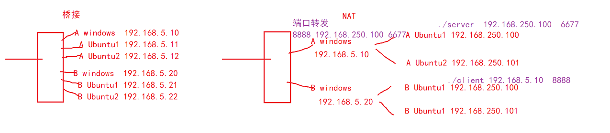

## 1. 网络发展历史

> ARPAnet即阿帕网，使用网络控制协议(Network Control Protocol，**NCP**)
> OSI开放系统互联模型，七层，物链网传会表应
>
> TCP/IP协议族体系结构：
>
> 应用层、传输层、网络层、数据链路层
>
> socket原本也是用于同主机的进程间通信的,后来有了TCP/IP协议族的加入才能实现不同主机的进程间通信。

```c
每层常见的协议：
应用层：
HTTP(Hypertext Transfer Protocol)   超文本传输协议
万维网的数据通信的基础
FTP(File Transfer Protocol)  文件传输协议
是用于在网络上进行文件传输的一套标准协议，使用TCP传输
TFTP(Trivial File Transfer Protocol)   简单文件传输协议
是用于在网络上进行文件传输的一套标准协议，使用UDP传输
SMTP(Simple Mail Transfer Protocol)  简单邮件传输协议
一种提供可靠且有效的电子邮件传输的协议
    
传输层：
TCP(Transport Control Protocol)  传输控制协议
是一种面向连接的、可靠的、基于字节流的传输层通信协议
UDP(User Datagram Protocol)  用户数据报协议
是一种无连接、不可靠、快速传输的传输层通信协议
    
网络层：
IP(Internetworking Protocol)   网际互连协议
是指能够在多个不同网络间实现信息传输的协议
ICMP(Internet Control Message Protocol)   互联网控制信息协议
用于在IP主机、路由器之间传递控制消息----ping命令使用的协议
IGMP(Internet Group Management Protocol)   互联网组管理
是一个组播协议，用于主机和组播路由器之间通信
    
链路层：
ARP(Address Resolution Protocol)  地址解析协议
通过IP地址获取对方mac地址即网卡
RARP(Reverse Address Resolution Protocol)  逆向地址解析协议
通过mac地址获取ip地址
```

> 每层使用的协议由下层决定
>
> 网络模型简而言之就是进行数据封装
>
> 一帧数据 46-1500

## 2. TCP和UDP的异同

> TCP（即传输控制协议）
> 是一种面向连接的传输层协议，它能提供高可靠性通信(即数据无误、数据无丢失、数据无失序、数据无重复到达的通信)
> 适用情况：
> 适合于对传输质量要求较高，以及传输大量数据的通信。
> 在需要可靠数据传输的场合，通常使用TCP协议
> MSN/QQ等即时通讯软件的用户登录账户管理相关的功能通常采用TCP协议
>
> 
>
> UDP（User Datagram Protocol）用户数据报协议
> 是不可靠的无连接的协议。在数据发送前，因为不需要进行连接，所以可以进行高效率的数据传输。
> 适用情况：
> 发送小尺寸数据（如对DNS服务器(域名解析服务器)进行IP地址查询时）
> 在接收到数据，给出应答较困难的网络中使用UDP。（如：无线网络）
> 适合于广播/组播式通信中。
> MSN/QQ/Skype等即时通讯软件的点对点文本通讯以及音视频通讯通常采用UDP协议
> 流媒体、VOD、VoIP、IPTV等网络多媒体服务中通常采用UDP方式进行实时数据传输

## 3. 网络相关知识

> 字节序：不同类型CPU的主机中，内存存储多字节整数序列有两种方法，称为**主机字节序**(HBO)(小端序，大端序)
>
> **网络字节序规定为大端序**
>
> 
>
> **什么样的数据发送是需要考虑字节序**？
>
> 1. 明确知道收发数据的双方字节序一样的时候，可以不考虑字节序。
>
> 2. 多字节的数据作为整体发送和接收时，就需要考虑字节序的问题了(字符串不需要考虑)

### 端口字节序转换方式

```c
// h host主机，to 转换，n network网络，l 4Byte，s 2字节
htonl(); ntohl(); htons(); ntohs();
```

### socket的类型

> 1. 流式套接字(SOCK_STREAM) ----TCP用的
>     提供了一个面向连接、可靠的数据传输服务，数据无差错、无重复的发送且按发送顺序接收。内设置流量控制，避免数据流淹没慢的接收方。数据被看作是字节流，无长度限制。
>
> 2. 数据报套接字(SOCK_DGRAM) ----UDP用的
>     提供无连接服务。数据包以独立数据包的形式被发送，不提供无差错保证，数据可能丢失或重复，顺序发送，可能乱序接收。
>
> 3. 原始套接字(SOCK_RAW)----原始套接字使用
>     可以对较低层次协议如IP、ICMP直接访问。

### IP地址

> MAC地址占用**6个字节**，局域网内部使用 MAC地址通信，如果数据想走出局域网，就需要用到IP地址了。
>
> IP地址的分类
>
> IPV4	**4字节**  32bit
>
> IPV6	**16字节**  128bit
>
> 因为有NAT技术的加持，能很大程度缓解IP地址不够用的问题。
>
> (Network Address Translation)网络地址转换
>
> IPV4地址的组成：网络号+主机号
>
> 其中每个IP地址又可以通过路由器，下发局域网IP地址，每类IP地址都有专门划分子网的保留段。
>
> 子网掩码：**是由一堆连续的1和连续的0组成的，用来划分子网。**
>
> .0网络号 .255广播地址 .1网关
>
> 每个子网中有需要减掉网络号、广播地址、网关地址

### IP字节序转换方式

```c
//将点分十进制的字符串转换成网络字节序的无符号四字节整型的ip地址
inet_addr() 
//将网络字节序的无符号四字节整型的ip地址转换成点分十进制的字符串
inet_ntoa() 
```

### 端口号

> 端口号用来标识进程**(2字节)**
>
> linux系统端口号的范围 **[0-65535]共计65536个**使用**unsigned short**存储
>
> linux系统中 **/etc/services** 中保存的就是当前系统中已经被占用的端口号

> 常见服务使用的端口号：
>
> ftp  21
>
> ssh  22
>
> tftp  69
>
> http  80 8080
>
> mysql  3306

## 4. TCP网络编程

### 流程

> 服务器流程：(6步)
>
> 创建流式套接字 socket()
>
> 填充服务器的网络信息结构体
>
> 将服务器的网络信息结构体和套接字绑定 bind()
>
> 将套接字设置成被动监听状态 listen()
>
> 阻塞等待客户端连接  accept()
>
> 收发数据  read  write
>
> 关闭套接字 close()
>
> 
>
> 客户端流程：（4步）
>
> 创建流式套接字 socket()
>
> 填充服务器的网络信息结构体
>
> 与服务器建立连接  connect()
>
> 收发数据  read  write
>
> 关闭套接字 close()

### socket()

```c
功能：
	创建套接字
函数原型：
	int socket(int domain, int type, int protocol);
参数：
	domain：通信领域
		AF_UNIX, AF_LOCAL	本地通信使用
		AF_INET				IPV4使用
		AF_INET6			IPV6使用
		AF_PACKET			原始套接字使用
	type：套接字的类型
		SOCK_STREAM			TCP使用
		SOCK_DGRAM			UDP使用
		SOCK_RAW			原始套接字使用
	protocol：附加协议
		如果没有，一般填0即可
返回值：
	成功  套接字(文件描述符)
	失败  -1  重置错误码
```

### bind()

```c
功能：
	将套接字和网络信息结构体绑定
函数原型：
	int bind(int sockfd, const struct sockaddr *addr, socklen_t addrlen);
参数：
	sockfd：套接字
	addr：
		struct sockaddr {
			sa_family_t sa_family;
			char        sa_data[14];
		}
		//上面的结构体只是用于强转 防止编译警告的
		//我们实际使用的是下面的结构体
		struct sockaddr_in {
			sa_family_t    sin_family; /* AF_INET */
			in_port_t      sin_port;   /* 网络字节序的端口号 */
			struct in_addr sin_addr;   /* IP地址 */
		};
		/* Internet address. */
		struct in_addr {
			uint32_t       s_addr;     /* 网络字节序的无符号4字节整型的IP地址 */
		};
	addrlen：addr的大小
返回值：
	成功 0
	失败 -1 重置错误码
```

### connect()

```c
功能：
	与服务器建立连接
函数原型：
	int connect(int sockfd, const struct sockaddr *addr, socklen_t addrlen);
参数：
	sockfd：套接字
	addr：服务器的网络信息结构体
	addrlen：addr的大小
返回值：
	成功 0
	失败 -1 重置错误码
```

### listen()

```c
功能：
	将套接字设置成被动监听状态
	只有被动监听状态的套接字才能accept接收客户端的连接请求
函数原型：
	int listen(int sockfd, int backlog);
参数：
	sockfd：套接字
	backlog：半连接队列的最大长度
			一般设置成 5  10 都可以 只要不是0就行
返回值：
	成功 0
	失败 -1 重置错误码
```

### accept()

```c
功能：
	接收客户端的连接请求（提取半连接队列的第一个连接）
	他会返回一个新的文件描述符专门用于和该客户端通信
函数原型：
	int accept(int sockfd, struct sockaddr *addr, socklen_t *addrlen);
参数：
	sockfd：已经设置成被动监听状态的套接字
	addr：用来保存客户端网络信息结构体的缓冲区的首地址
			如果不关心客户端的网络信息结构体 可以传 NULL
	addrlen：addr的大小
返回值：
	成功 新的文件描述符 专门用于和当前客户端通信
	失败 -1 重置错误码
```

## 5. 桥接模式和NAT模式的区别



> c 连接winIP的8888端口
> s 端口转发win端口号8888转发到自己的虚拟机IP及端口