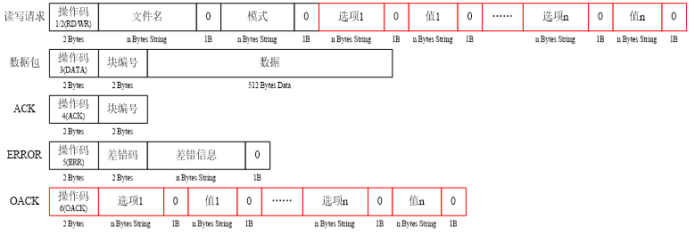

## TCP网络编程

### recv()/send()

```c
//收
函数原型：
	ssize_t recv(int sockfd, void *buf, size_t len, int flags);
功能：
	在套接字上接收一条消息
参数：
	sockfd：套接字
	buf：用来接收数据的缓冲区的首地址
	len：想要接收的数据的字节数
	flags：如果设置成0 则recv和read就一样了
			如果设置成 MSG_DONTWAIT  表示非阻塞
返回值：
	成功 实际接收的字节数
	失败 -1 重置错误码 
	对方关闭套接字或者断开连接的时候 recv会返回0
 //发   
函数原型：
	ssize_t send(int sockfd, const void *buf, size_t len, int flags);
功能：
	向套接字上发送一条消息
参数：
	sockfd：套接字
	buf：要发送的数据的首地址
	len：想要发送的数据的字节数
	flags：如果设置成0 则send和write就一样了
			如果设置成 MSG_DONTWAIT  表示非阻塞
返回值：
	成功 实际发送的字节数
	失败 -1 重置错误码 
	对方关闭套接字或者断开连接的时候：
		第一次send是没有反应
		第二次再send时候 会产生一个管道破裂

```

### **TCP粘包问题**

> 原因：
>
> 1. Nagle算法：将多个小的包组装成整体发送
> 2. 缓冲区问题
>
> 解决办法：
>
> 1. 规定一次发送的大小，协议(“len|text”)，收的使用写入len大小的数据
> 2. 每次计算大小
> 3. 加分隔符确定数据边界，如strlen的边界‘\0’

> 休眠：不占用cpu(sleep)
>
> 延时：占用cpu(delay)

## UDP网络编程

### 创建流程

> 服务器流程：
>
> ​	创建用户数据报套接字(dgram)
>
> ​	将套接字和服务器的网络信息结构体绑定(填充服务器的网络信息结构体)
>
> ​	收发数据  recvfrom/sendto
>
> ​	关闭套接字
>
> 客户端流程：
>
> ​	创建用户数据报套接字
>
> ​	填充服务器的网络信息结构体
>
> ​	收发数据  recvfrom/sendto
>
> ​	关闭套接字

### recvfrom()/sendto()

```c
//收
函数原型：
	ssize_t recvfrom(int sockfd, void *buf, size_t len, int flags,
                    struct sockaddr *src_addr, socklen_t *addrlen);
功能：
	在套接字上接收一条消息
参数：
	前4个参数和recv函数的前四个参数一样
	后两个参数和accept函数的后两个参数一样
	是用来保存客户端的网络信息结构体的
返回值：
	成功 实际接收的字节数
	失败 -1 重置错误码 
	recvfrom不会返回0
//发
ssize_t sendto(int sockfd, const void *buf, size_t len, int flags,
                    const struct sockaddr *dest_addr, socklen_t addrlen);
功能：
	向套接字上发送一条消息
参数：
	前4个参数和send函数的前4个参数一样
	后2个参数和bind、connect函数的后2个参数一样
	是用来指定接收方的信息的
返回值：
	成功 实际发送的字节数
	失败 -1 重置错误码
```

## TFTP协议

> 简单文件传输协议：最初用于引导无盘系统，后被设计用来传输小文件
>
> 特点：
> 	基于UDP协议实现
> 	不进行用户有效性认证
> 数据传输模式：
> 	**octet：二进制模式**
> 	netascii：文本模式
> 	mail：已经不再支持

### TFTP概述

> TFTP通信过程总结（无选项）
> 1、服务器在69号端口等待客户端的请求
> 2、服务器若批准此请求,则使用临时端口与客户端进行通信
> 3、每个数据包的编号都有变化（从1开始）
> 4、每个数据包都要得到ACK的确认如果出现超时,则需要重新发送最后的包（数据或ACK）
> 5、数据的长度以512Byte传输	
> 6、小于512Byte的数据意味着传输结束



> **错误码：**
> 0 未定义,参见错误信息
> 1 File not found.
> 2 Access violation.
> 3 Disk full or allocation exceeded.
> 4 illegal TFTP operation.
> 5 Unknown transfer ID.
> 6 File already exists.
> 7 No such user.
> 8 Unsupported option(s) requested.