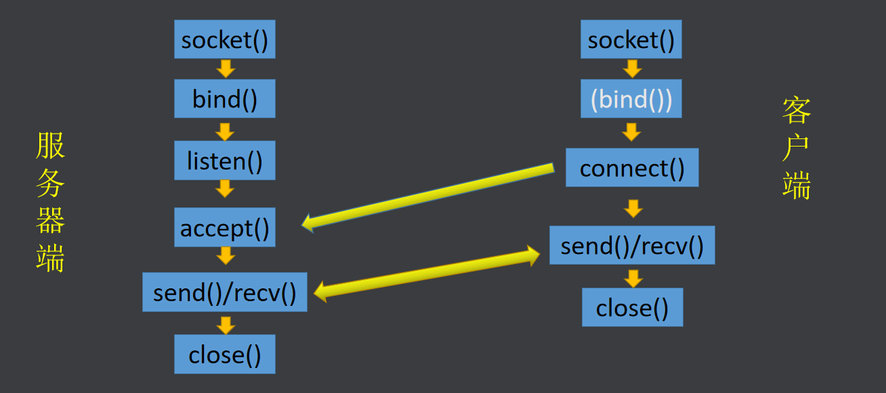
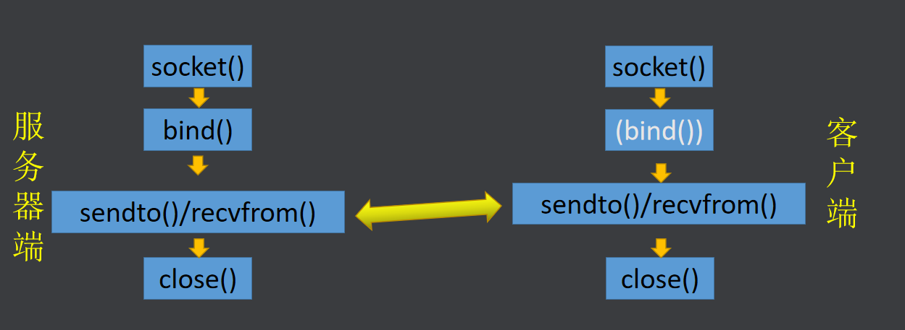

## 1. wireshark抓包

### 软件说明

> Wireshark 是网络包分析工具。
>
> 网络包分析工具的主要作用是尝试捕获网络包，并尝试显示包的尽可能详细的情况。
>
> ​	网络管理员用来解决网络问题
>
> ​	网络安全工程师用来检测安全隐患
>
> ​	开发人员用来测试协议执行情况
>
> ​	初学者可以用来学习网络协议

>过滤器的使用：
>常见的过滤方式：
>tcp.port\==8888
>ip.dst\==xxxxx
>ip.src\==xxxxx
>ip.addr==xxxx
>过滤的语句可以使用 and 或者 or 连接多句

### 链路层

> 以太网头(MAC头)**14字节**：目的地址6，源地址6，网络层使用协议类型2
>
> 0x0800 IP协议IPV4
>
> 0x0806 ARP协议
>
> 0x8035 RARP协议
>
> **注意：交换机是工作在链路层的设备，是根据目的mac地址决定如何转发消息的。局域网内部根据MAC地址.**

### 网络层

> IP报头 **20字节**：版本 首部长度(5->20) 总长度 TTL(跳数限制) 后面的协议 源IP 目的IP 
>
> **注意：路由器是工作在网络层的设备，他是根据目的ip地址来决定如何转发数据的。**

### 传输层

> TCP报头 **20字节**：源端口号 目的端口号 序列号Seq 确认号Ack 首部长度(5->20) 窗口尺寸
>
> 端口号标志进程
>
> **连接机制：**
>
> **Seq(Sequence Number)序列号 Ack(Sequence Number)确认号 32bin** 校验机制
>
> SYN FIN ACK **标志位** **1bin**
>
> SYN(synchronous) Seq
>
> FIN(finish) Seq
>
> ACK(acknowledgement character) 应答数据包 Ack
>
> `重传机制保证数据无误`
>
> `滑动窗口机制(65535)提高效率`
>
> 
>
> 标志位：每个标志位占用1Bit，共有6个，分别为 URG、ACK、PSH、RST、SYN、FIN，具体含义如下：
>
> * URG：紧急指针（urgent pointer）有效。
> * ACK：确认序号有效。
> * PSH：接收方应该尽快将这个报文交给应用层。
> * RST：重置连接。
> * SYN：建立一个新连接。
> * FIN：断开一个连接。

#### **TCP的三次握手四次挥手**

> TCP三次握手四次挥手：
> 三次握手发生在建立连接的过程中，由**客户端**发起，通信双方确认对方收发数据能力没问题,**也是同步序列号的过程**。(至少三次，四次没必要)
>
> 发生在**客户端connect()和服务器accept()[listen()]**之间
>
> 
>
> 四次挥手发生在断开连接的过程中，由**主动关闭方**发起(一般情况下都由客户端发起的)。

```c
SYN Seq=x;
SYN Seq=y, ACK Ack=x+1 ;
ACK Ack=y+1;

FIN Seq=x;
ACK Ack=x+1;
FIN Seq=y;
ACK Ack=y+1;
```

### 应用层

> (send)以16进制显示用户数据

## 2. TCP/UDP网络编程总结

### TCP网络编程



> 1. 客户端一般不需要绑定自己的网络信息结构体？
> 	因为操作系统会自动给客户端的ip地址和端口号赋值，也方便用户操作。如果想要手动指定，也可以，需要调用bind()函数即可。
> 2. 服务器端accept函数的后两个参数即使设置成NULL，服务器也可以给客户端回复消息？
> 	原因是，服务器侧不是依赖于手动给定的IP地址和端口号来联系客户端的，而是给每个客户端都分配一个独立的文件描述符acceptfd，来专门用于和该客户端通信，也就是说TCP的服务器，**acceptfd和客户端是一一对应的关系**。**(connect()将客户端的网络信息结构体发送给服务端accept())**
> 3. TCP网络编程中可以使用 read/write  recv/send  recvfrom/sendto 来收发数据。
> 4. 服务器端的accept函数本质就是一个阻塞的读函数，也就是一个接收函数，客户端的connect函数本质就是个写函数，也就是一个发送函数，收发的数据本质就是客户端的网络信息结构体。
> 5. **TCP的服务器默认的是一个循环服务器，没法同时处理多个客户端的请求**?
> 	原因是tcp的服务器有两个阻塞函数 accept 和 recv，两个函数之间相互会有影响。
> 	可以使用 多进程 多线程 IO多路复用 来解决。

### UDP网络编程



> 1. UDP是无连接的，但是也可以双向的收发数据?
>     因为UDP使用的是 recvfrom/sendto 来收发数据，sendto时可以指定接收方的信息。
>     sendto函数相当于 send函数和 connect函数的二合一
>     recvfrom函数相当于 recv函数和 accept函数的二合一
> 2. UDP中客户端也可以使用 connect 函数先将自己的网络信息结构体发给服务器，然后就可以使用 send 和 recv 收发数据了。
> 3. 如果UDP服务器端的recvfrom函数的后两个参数设置成 NULL了，这样接收数据是没有问题的，但是就没法给发送方回信了，因为sendto的后两个参数没没法填写，没有接收客户端的网络信息结构体。
> 4. **UDP服务器默认的就是一个并发服务器**？
>     因为只有一个阻塞的函数 recvfrom。

## 3. IO模型

> 在UNIX/Linux下主要有4种I/O模型：
>
> 
>
> 阻塞I/O：最常用、最简单、效率最低
> 非阻塞I/O：可防止进程阻塞在I/O操作上，需要轮询
> I/O 多路复用：允许同时对多个I/O进行控制
> 异步通知(信号驱动I/O): 一种异步通信模型

### 阻塞IO(多个阻塞相互影响)

> 读写函数在调用过程中会发生阻塞以读操作为例：
>
> **当程序执行到读操作的时候**，如果缓冲区里有内容，则直接读取继续向下执行，如果缓冲区中没有内容，则进程就会进入休眠态，直到缓冲区中有内容的时候，内核唤醒该进程，来读取内容，读取后继续向下执行。

### 非阻塞IO(解决互相影响，轮询，占用CPU)

> **当程序执行到读操作的时候**，如果缓冲区里有内容，则直接读取继续向下执行，如果缓冲区中没有内容，则会立即返回一个错误，而不是让进程就进入休眠态，但是，这种用法我们需要不停的检查IO操作是否准备就绪，这种操作十分浪费CPU。

> 有些函数自带非阻塞标志位，但大部分函数没有非阻塞标志位，可以使用fcntl()来设置非阻塞。(设置的是文件)

#### fcntl()

```c
函数原型：
	int fcntl(int fd, int cmd, ... /* arg */ );
功能：
	操作文件描述符(设置对此文件的操作为非阻塞)
参数：
	fd：文件描述符
	cmd：操作的指令
		F_GETFL  获取文件描述符的状态  arg被忽略
		F_SETFL	设置文件描述符的状态  arg是一个int类型
			其中 O_NONBLOCK 表示非阻塞的标志位
	...：可变参 具体有没有取决于 cmd
		没有特殊说明时，大部分情况下 arg是一个int类型
返回值：
	如果cmd为F_GETFL  成功返回文件的状态
	如果cmd为F_SETFL  成功返回0
	失败 返回-1 重置错误码
```

```c
//使用fcntl()设置文件描述符非阻塞
int flag = fcntl(fd, F_GETFL); //先获取原有的状态
flag |= O_NONBLOCK; //添加非阻塞的标志位
fcntl(fd, F_SETFL, flag); //再重新设置回去
```

### **多路复用IO**

> 基本思想：
> 构建一个关于文件描述符的表，将要监视的文件描述符都放在这个表里，把这个表交个一个函数(select  poll  epoll)，这个函数默认也是阻塞的当要监视的这个文件描述符表中，有一个或多个文件描述符准备就绪的时候，这个函数就会返回，返回时，会告诉我们哪些文件描述符准备就绪了，我们对这些准备的就绪的文件描述再进行IO操作，就不会阻塞了。

#### select()

```c
函数原型：
    int select(int nfds, fd_set *readfds, fd_set *writefds,
            		   fd_set *exceptfds, struct timeval *timeout);
功能：
	实现多路IO复用
参数：
	nfds:		要监视的最大的文件描述符 +1
	readfds:	要监视的读文件描述符集合 不关心可以传 NULL
	writefds:	要监视的写文件描述符集合 不关心可以传 NULL
	execptfds:	要监视的异常文件描述符集合 不关心可以传 NULL
	timeout:	超时时间  设置成 NULL 表示 永久阻塞 直到有就绪的文件描述符
返回值：
	成功 就绪的文件描述符的个数
	超时 0
	失败 -1
注意事项：
	1.select只能监视小于 FD_SETSIZE(1024) 的文件描述符
	2.select每次返回时会将没有就绪的文件描述符在集合中擦除
		所以在循环中使用select时每次要重置集合
	3.我们一般只关心读文件描述符集合
宏函数：
        void FD_CLR(int fd, fd_set *set);		//将文件描述符在集合中删除
	int  FD_ISSET(int fd, fd_set *set);		//判断文件描述符是否还在集合中
											//不在了 返回 0
											//还在	返回 非0
	void FD_SET(int fd, fd_set *set);		//将文件描述符添加到集合中
	void FD_ZERO(fd_set *set);				//清空文件描述符集合
fd_set	bit数组
fd_set(结构体(数组))
    typedef struct{
        long s[16];		16*8*8 = 1024 bit
    }fd_set; //最大1024
```

