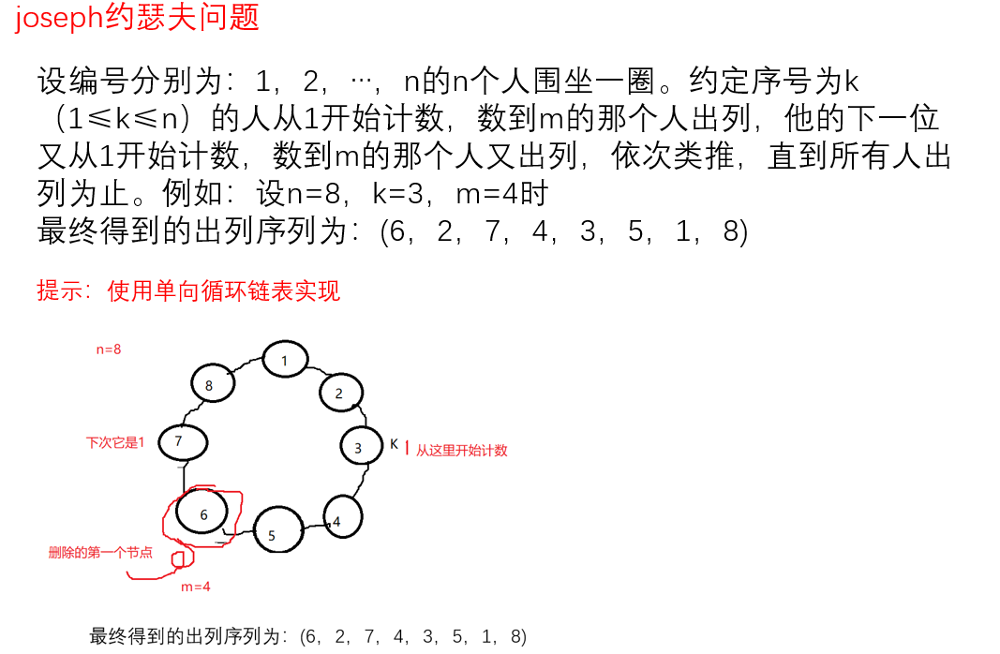
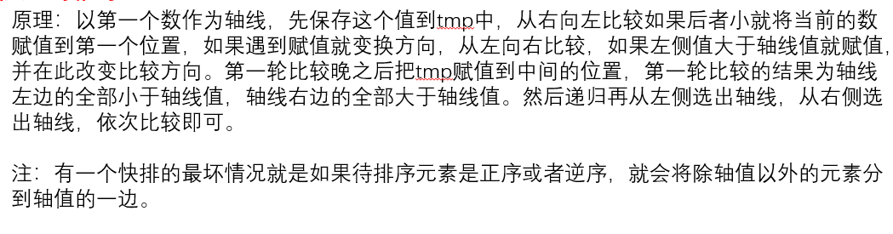

##  算法与例题

### 1. 约瑟夫问题(单向循环链表)

==出环：1、判断环中是否还有成员 2、找删除结点上一个位置
两个公式：初始移位(pos=k+m-3)  下次移位(pos=m-1)==



```c
// 约瑟夫环，n为总结点数，k为起始位置，m为数几个数
typedef struct node {
    int data;
    struct node* next;
} loopnode_t;
// 入环
loopnode_t* JosephCreate(int n)
{
    loopnode_t* h = (loopnode_t*)malloc(sizeof(*h));
    if (!h) {
        printf("%s create error\n", __func__);
        return NULL;
    }
    h->data = n;
    h->next = h;
    loopnode_t* temp;
    for (int i = n - 1; i > 0; i--) {
        temp = (loopnode_t*)malloc(sizeof(*temp));
        if (!h) {
            printf("%s create error\n", __func__);
            return NULL;
        }
        temp->data = i;
        temp->next = h->next;
        h->next = temp;
    }
    h = h->next;
    return h;
}
// 出环
void JosephDelete(loopnode_t* h, int k, int m)
{
    if (!h) {
        printf("%s loopnode empty error\n", __func__);
        return;
    }
    //**************************************
    int pos = k + m - 3; // 初始删除位移动次数
    loopnode_t* temp;
    while (h->next != h) { // 环中是否还有成员
        // 找到删除位置
        while (pos) {
            h = h->next;
            pos--;
        }
        temp = h->next;
        printf("%d ", temp->data);
        h->next = temp->next; // 连接
        free(temp);
        temp = NULL;
        pos = m - 1; // 下一次删除移动次数
    }
    printf("%d\n", h->data); // 最后的成员
    free(h);
    h = NULL;
    //**************************************
}
```

### 2. 快排



```c
// 快排
void QuickSort(int* arr, int beg, int end)
{
    if (!(beg < end))
        return;
    int i = beg, j = end;
    int temp = arr[i];
    while (i < j) {
        while ((i < j) && (temp <= arr[j])) {
            j--;
        }
        arr[i] = arr[j];
        while ((i < j) && (arr[i] <= temp)) {
            i++;
        }
        arr[j] = arr[i];
    }
    arr[i] = temp;
    QuickSort(arr, beg, i - 1);
    QuickSort(arr, i + 1, end);
}
```

### 3. 将系统时间写入文件练习

要求：将系统当前的时间写入到time.txt的文件中，如果ctrl+c退出之后，在再次执行支持断点续写1.2022-03-25 19:10:20
2.2022-03-25 19:10:21
3.2022-03-25 19:10:22
//按下ctrl+c停止，再次执行程序
4.2022-03-25 20:00:00
5.2022-03-25 20:00:01
注：禁止使用sleep和usleep

```c
#include <head.h>
int GetFileLen(FILE* fp)
{
    int line = 0;
    char s[20] = { 0 };
    while (fgets(s, sizeof(s), fp)) {
        if (s[strlen(s) - 1] == '\n')
            line++;
    }
    return line;
}

int main(int argc, const char* argv[])
{
    time_t ts, ots;
    struct tm* tm;
    int line;
    FILE* fp;
    char tm_buf[128] = { 0 };
    // 1.打开文件
    if ((fp = fopen("./time.txt", "a+")) == NULL)
        PRINT_ERR("fopen error");
    // 2.获取文件中的行号
    line = GetFileLen(fp);
    // 3.循环向文件中写时间
    ts = ots = 0;
    while (1) {
        // 1.获取秒钟数
        if ((ts = time(NULL)) == (time_t)-1)
            PRINT_ERR("get time error");

        if (ts != ots) {
            ots = ts;
            // 2.进行时间转换
            if ((tm = localtime(&ts)) == NULL)
                PRINT_ERR("change time error");

            snprintf(tm_buf, sizeof(tm_buf), "%4d.%d-%02d-%02d %02d:%02d:%02d\n",
                line++, tm->tm_year + 1900, tm->tm_mon + 1,
                tm->tm_mday, tm->tm_hour, tm->tm_min,
                tm->tm_sec);
            
            fputs(tm_buf, fp);
            
            //fflush刷新缓冲区
            if (fflush(fp) == EOF)
                PRINT_ERR("fflush error");
        }
    }

    fclose(fp);
    return 0;
}
```

### 4. 如果hello.txt文件不存在就创建文件以只写的方式打开，如果文件存在以只读的方式打开。

```c
// 方式一
FILE* fp;
fp = fopen("./hello.txt","r");
if(fp==NULL){
	if(errno==2){
        fp = fopen("./hello.txt","w");
    }else{
        PRINT_ERR("fopen error");
    }
}

// 方式二
int fd;
if ((fd = open("./hello.txt", O_WRONLY | O_CREAT | O_EXCL, 0666)) == -1) {
    if (errno == EEXIST) {
        fd = open("./hello.txt", O_RDONLY);
    } else {
        PRINT_ERR("open error");
    }
}
```
